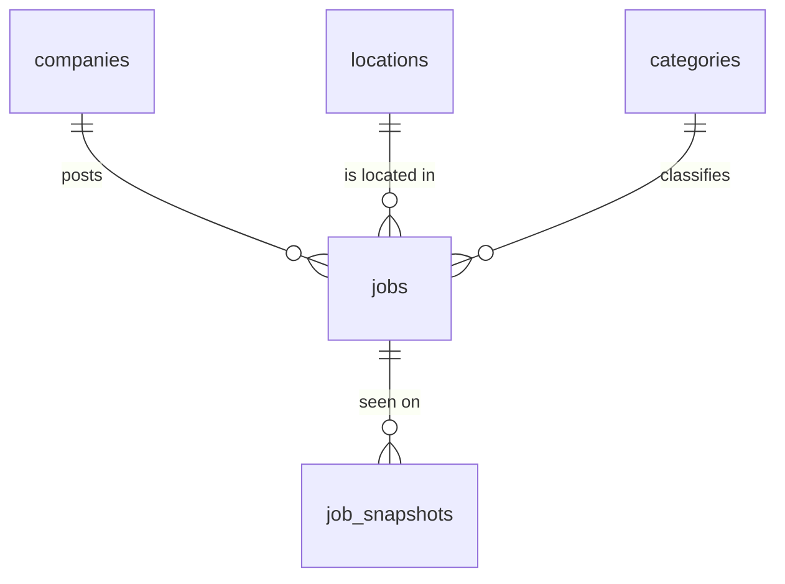

# Job Market SQL Pipeline

An automated ETL pipeline that collects data analyst job postings in Wrocław from the [Adzuna API](https://developer.adzuna.com/) and stores them in a PostgreSQL database (hosted on Neon) for SQL analysis.

## How it works

```
Adzuna API → transform (Pandas) → data quality checks → PostgreSQL (Neon)
```

- **Collection** – fetches up to 250 current "data analyst" offers in Wrocław (5 pages × 50).
- **Transformation** – flattens nested API fields, parses dates and removes duplicates. Intermediate files are generated at runtime and are not stored in git.
- **Data quality** – a report on missing values, duplicate IDs, invalid salary ranges and dates is printed in every run.
- **Loading** – new companies, locations, categories and jobs are added to the database. Existing records are never duplicated, so the pipeline is safe to re-run.
- **Daily snapshots** – every run records which jobs are still active, so the data can show how long offers stay open and how the market changes over time.
- **Automation** – GitHub Actions runs the full pipeline every day (06:17 UTC).

## Database model



## Tech stack

Python 3.12 · Pandas · PostgreSQL (Neon) · SQL · psycopg2 · REST API · GitHub Actions

## Project structure

```
├── .github/workflows/   # daily pipeline run
├── sql/                 # schema and analysis queries
├── src/                 # ETL scripts and pipeline runner
├── .env.example         # required environment variables
└── requirements.txt
```

## Getting started

```bash
git clone https://github.com/mkplwro/job-market-sql-pipeline.git
cd job-market-sql-pipeline
pip install -r requirements.txt
```

1. Create the tables in your PostgreSQL database with `sql/01_schema.sql`.
2. Copy `.env.example` to `.env` and fill in:
   - `ADZUNA_APP_ID`, `ADZUNA_APP_KEY` – Adzuna API credentials
   - `CLOUD_DB_HOST`, `CLOUD_DB_PORT`, `CLOUD_DB_NAME`, `CLOUD_DB_USER`, `CLOUD_DB_PASSWORD` – database connection
3. Run the pipeline:

```bash
python src/pipeline.py
```

## Example analysis

The `sql/` folder contains queries on job counts by company and category, salary statistics (excluding salaries predicted by Adzuna), and trends based on daily snapshots, using `JOIN`s, CTEs and window functions.

## Roadmap

- Analysis of hiring trends and offer lifetime from snapshots
- Reporting and visualizations

## Status

In progress – new features are added regularly.